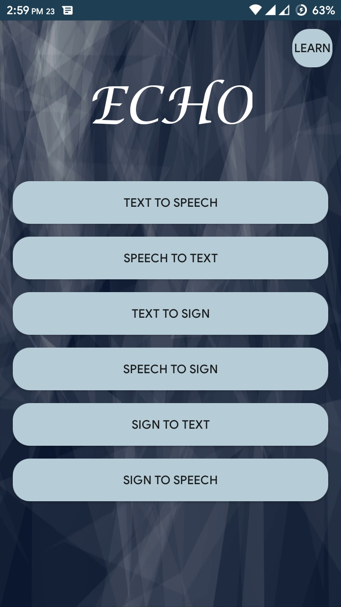

# ECHO
Echo is an language conversion app that take a form of language such as text, speech, sign as input and convert them into another form.

**App Link**: [https://drive.google.com/file/d/1A96UCvGMN7egdgWwrFBrqMM0CqNyZnoH/view?usp=sharing](https://drive.google.com/file/d/1A96UCvGMN7egdgWwrFBrqMM0CqNyZnoH/view?usp=sharing)

## Background
We managed to achieve 2nd Runners' up at LICT SUST Techfest, 2019, Hackathon with this app. The entire app, from start to finish, was built within the 40 hours timeframe of the contest.

# Issue
The website we used for parsing the sign images is different now, so the input to sign language conversion doesn't work.

# Screenshot
